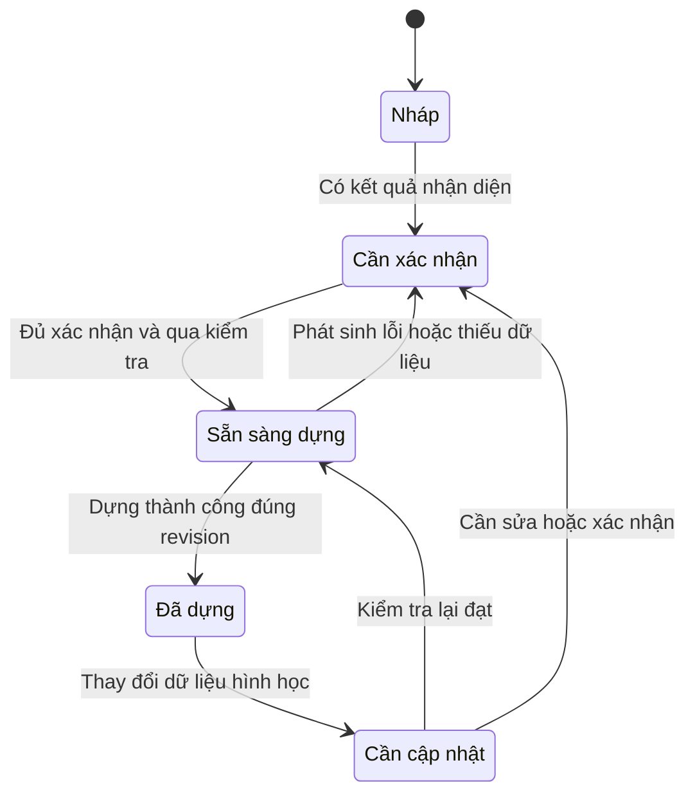

# Trạng thái và truy vết

## 17. Trạng thái và điều kiện chuyển

Sơ đồ sau là **sơ đồ trạng thái nghiệp vụ**, không phải sơ đồ use case UML. Trạng thái tác vụ nền và trạng thái đã/chưa lưu được theo dõi riêng.

| Sự kiện | Quy tắc trạng thái |
| --- | --- |
| Nhận diện/dựng đang chạy | Hiển thị trạng thái tác vụ; không giả định đã có kết quả |
| Tác vụ thất bại | Giữ bản dữ liệu/bản lưu trước; báo trạng thái lỗi của tác vụ |
| Đổi tỷ lệ hoặc thông số hình học | Mất tính hiện hành của 3D; kiểm tra lại phần ảnh hưởng |
| Chỉ đổi góc camera | Không thay trạng thái hợp lệ hoặc revision hình học |
| Lưu bản nháp | Được phép, kể cả khi chưa đủ điều kiện dựng |
| Kết quả tác vụ lệch revision | Không tự áp dụng như kết quả hiện hành |

## 18. Ma trận truy vết yêu cầu

Mã FR và BR kế thừa tài liệu nghiệp vụ. Ma trận bảo đảm các chức năng đã xác định có use case và tiêu chí kiểm thử tương ứng.

| Yêu cầu | Use case chi tiết | Tiêu chí đại diện |
| --- | --- | --- |
| FR01 — Tạo/lưu/mở | UC03 | AC-UC03-01, AC-UC03-02, AC-UC03-03 |
| FR02 — Nhập bản vẽ | UC04 | AC-UC04-01, AC-UC04-02, AC-UC04-03 |
| FR03 — Tỷ lệ/đơn vị | UC05 | AC-UC05-01, AC-UC05-02, AC-UC05-03 |
| FR04 — Nhận diện | UC06 | AC-UC06-01, AC-UC06-02, AC-UC06-03 |
| FR05 — Đối chiếu | UC07 | AC-UC07-01, AC-UC07-02 |
| FR06 — Chỉnh sửa | UC02 | AC-UC02-01, AC-UC02-02 |
| FR07 — Thông số/nguồn | UC07, UC08 | AC-UC07-02, AC-UC08-03 |
| FR08 — Kiểm tra | UC09 | AC-UC09-01, AC-UC09-02, AC-UC09-03 |
| FR09 — Dựng/xem 3D | UC10 | AC-UC10-01, AC-UC10-03 |
| FR10 — Đồng bộ/hoàn tác | UC02, UC10, UC11 | AC-UC02-03, AC-UC10-02, AC-UC11-01 |
| FR11 — OCR | UC12 | AC-UC12-01, AC-UC12-02, AC-UC12-03 |
| FR12 — Xuất | UC13 | AC-UC13-01, AC-UC13-02, AC-UC13-03 |

### Quy tắc kế thừa tóm tắt

| Mã | Nội dung |
| --- | --- |
| BR01 | Xác nhận chiều dài tham chiếu và đơn vị trước khi công nhận đúng tỷ lệ |
| BR02 | Tách nguồn thông số khỏi trạng thái xác nhận |
| BR03 | Không biến thông số thiếu thành dữ kiện đã xác nhận |
| BR04 | Kích thước dương; ngưỡng khác phải được chốt |
| BR05 | Lỗ mở có tường chủ hợp lệ và nằm trong phạm vi tường |
| BR06 | Quản lý tường chung, tránh dựng trùng |
| BR07 | Ranh giới phòng hợp lệ; phòng có thể nối qua lối mở |
| BR08 | Phân biệt chung tường với kết nối di chuyển |
| BR09 | Không tự ép/nối hình học ngoài dung sai được quy định |
| BR10 | Kiểm tra phụ thuộc khi sửa, giữ trạng thái 2D–3D nhất quán |
| BR11 | Nhận diện lại không tự ghi đè phần đã xác nhận |
| BR12 | Đạt kiểm tra ứng dụng không đồng nghĩa được thẩm định xây dựng |
